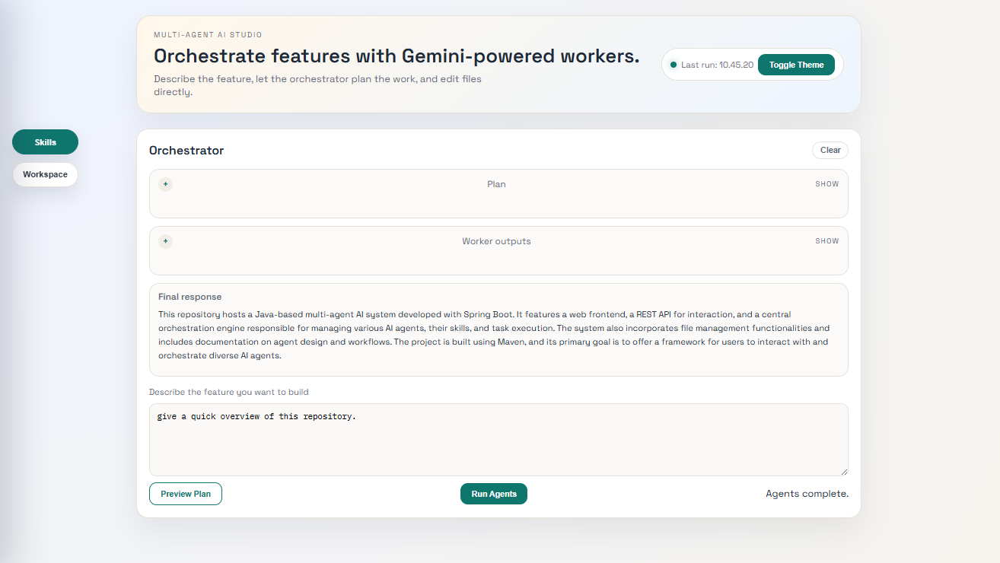

# Multi-Agent Agentic AI Studio

Multi-Agent AI Orchestration system built with **Spring Boot 3.5**, **Spring AI 1.1**, and **Google Gemini**. This repository provides a reference implementation for decomposing complex user requests into parallel tasks, assigning them to specialized worker agents, and synthesizing their outputs into a single coherent response.



## 🚀 Core Capabilities

### 1. Dynamic Task Planning
The **Orchestrator Agent** analyzes user requests and dynamically breaks them down into multiple independent, parallelizable tasks. Each task is defined with a specific goal, required role, and context, ensuring a structured approach to complex problems.

### 2. Parallel Agent Execution
Tasks are executed concurrently by specialized **Worker Agents**. The system manages a thread pool (configurable via `worker-concurrency`) to maximize throughput and reduce the overall time to completion.

### 3. Specialized Worker Roles & Skills
Agents can be assigned specific roles such as **Analysis**, **Research**, **Engineering**, **Design**, **QA**, and **Writing**. Each role (and the Orchestrator/Synthesis phases) can be enhanced with **specialized skills**—specific instructions and context that guide the agent's behavior and output quality.

### 4. Seamless Synthesis
Once all parallel tasks are completed, a **Synthesis Agent** gathers the results, resolves any conflicts, and combines the individual outputs into a unified, high-quality final response.

### 5. Filesystem Access via MCP
Integrated with the **Model Context Protocol (MCP)**, the agents have controlled access to the project workspace. They can read, write, and analyze files directly, allowing them to perform real-world engineering and research tasks.

### 6. Interactive Studio UI
The project includes a modern, dark-themed web interface for:
- **Orchestration**: Direct interaction with the Orchestrator.
- **Real-time Monitoring**: View the generated plan and watch worker outputs as they arrive.
- **Skill Management**: Dynamically add, remove, and configure agent skills for different phases and roles.
- **Workspace Explorer**: Integrated file explorer and code editor for immediate inspection and modification of the workspace.

## 🛠️ Architecture

The system follows a three-phase workflow:

1.  **Plan**: The Orchestrator agent creates an `OrchestratorPlan` containing up to `maxTasks` (default: 4) independent `TaskSpec` entries.
2.  **Execute**: Worker agents execute tasks in parallel. Each worker is assigned a role and provided with the relevant context and skills.
3.  **Synthesize**: If multiple tasks were executed, the synthesis phase combines the outputs. For single-task requests, the worker output is returned directly.

## 💻 Technology Stack

- **Java**: 21
- **Framework**: Spring Boot 3.5.10
- **AI Integration**: Spring AI 1.1.2 (BOM)
- **LLM**: Google Gemini (`gemini-2.5-flash`)
- **Protocols**: Model Context Protocol (MCP) for tool access.
- **Frontend**: Vanilla JS, CSS Custom Properties (Dark/Light mode support).

## ⚙️ Getting Started

### Prerequisites
- Java 21+
- Maven
- `GOOGLE_API_KEY` environment variable.

### Configuration
Key settings in `application.yml`:
```yaml
multiagent:
  max-tasks: 4           # Maximum parallel tasks per request
  worker-concurrency: 4  # Concurrent execution thread pool size
  worker-timeout: 90s    # Per-worker execution timeout
```

### Running the Application
```powershell
# Set your API key
$env:GOOGLE_API_KEY = "your-api-key"

# Build and run
mvn spring-boot:run
```
Access the UI at `http://localhost:8080`.

## 📂 Project Structure
- `src/main/java/com/bko/orchestration`: Core orchestration logic and services.
- `src/main/java/com/bko/config`: Spring configuration and multi-agent properties.
- `src/main/java/com/bko/api`: REST controllers for chat, planning, and file operations.
- `src/main/resources/static`: Studio UI assets.
- `assets/`: Documentation assets (images, etc.).

---
*Developed as a reference implementation for Multi-Agent Agentic AI patterns.*


## Local PostgreSQL with Docker Compose

You can spin up a local Postgres database for the app using Docker Compose.

Commands (PowerShell):

```powershell
# Start Postgres in background
docker compose up -d

# View logs
docker compose logs -f postgres

# Stop and remove
docker compose down
```

Default credentials provisioned by docker-compose.yml:
- DB: multiagent
- User: multiagent
- Password: multiagent
- Port: 5432

Configure the application to use this database (example env vars):

```powershell
$env:SPRING_DATASOURCE_URL = "jdbc:postgresql://localhost:5432/multiagent"
$env:SPRING_DATASOURCE_USERNAME = "multiagent"
$env:SPRING_DATASOURCE_PASSWORD = "multiagent"
$env:LIQUIBASE_ENABLED = "true"   # apply migrations on startup

mvn spring-boot:run
```

Notes:
- Liquibase changelog is applied when `LIQUIBASE_ENABLED=true`.
- The changelog enables `pgcrypto` (required for `gen_random_uuid()`), which is supported by the official Postgres image.
- Persisted data is stored in a named Docker volume `postgres_data`.
